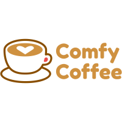
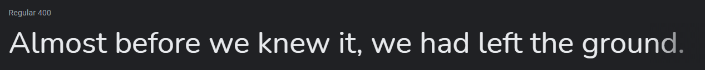
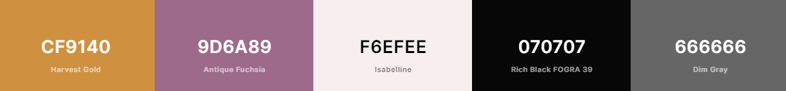

# [Comfy Coffee](https://comfy-coffee.anniew.xyz/) - a Coffee Shop Landing Page

This is the landing page for a fictitious coffee shop called "Comfy Coffee" based on [Starbucks'](https://www.starbucks.com/) website design.

It is currently not responsive. Please view it on desktop.

**LIVE DEMO** - [comfy-coffee.anniew.xyz](https://comfy-coffee.anniew.xyz/) OR [comfy-coffee.netlify.app](https://comfy-coffee.netlify.app/)

    
    
    
    

    

## Table of Contents

- [Design](#design)
  - [Logo](#logo)
  - [Fonts](#fonts)
  - [Color Scheme](#color-scheme)
- [Built With](#built-with)
- [Contributing](#contributing)
- [Creator / Maintainer](#creator--maintainer)
- [Acknowledgments](#acknowledgments)

---

## Design

### Logo

A cup of coffee with a heart and the coffee shop name in a font face that has rounded letters for all the comfy vibes.

Designed and downloaded for free on [FreeLogoDesign](https://www.freelogodesign.org/). _(not sponsored)_

### Fonts

[Nunito](https://fonts.google.com/specimen/Nunito) - this font is used for everything because the roundness in the font gives comfy vibes to match Comfy Coffee's branding.

### Color Scheme

- Harvest Gold - only used in the logo, but the rest of the color palette was made around it
- Antique Fushia - call to action buttons
- Isabelline - text background color and sign in & join hover background color
- Rich Black FORGRA 39 - black text color instead of normal #000 black
- Dim Gray - footer list items and copyright text

---

## Built With

- [HTML5](https://www.w3schools.com/html/)
- [CSS3](https://www.w3schools.com/css/)
- Hosted on [Netlify](https://www.netlify.com/)

---

## Contributing

Pull requests are welcome. For major changes, please open an issue first to discuss what you would like to change. Please make sure to update tests as appropriate.

### How To Contribute

1. Fork the repository to your own Github account.
2. Clone the project to your machine.
3. Create a branch locally with a succinct but descriptive name.
4. Commit changes to the branch.
5. Following any formatting and testing guidelines specific to this repo.
6. Push changes to your fork.
7. Open a Pull Request in my repository.

---

## Creator / Maintainer

Annie Wu ([anniedotexe](https://github.com/anniedotexe))

If you have any questions, comments, or concerns, feel free to contact me below.

  

This project was created for educational purposes and for personal and open-source use.

If you like my content or find this code useful, give it a :star: or support me by buying me a coffee :coffee::heart:

---

## Acknowledgments

- [CleverProgrammer](https://www.cleverprogrammer.com/) for their [Starbucks Clone tutorial](https://www.youtube.com/watch?v=DX2f5wAGrkk)
